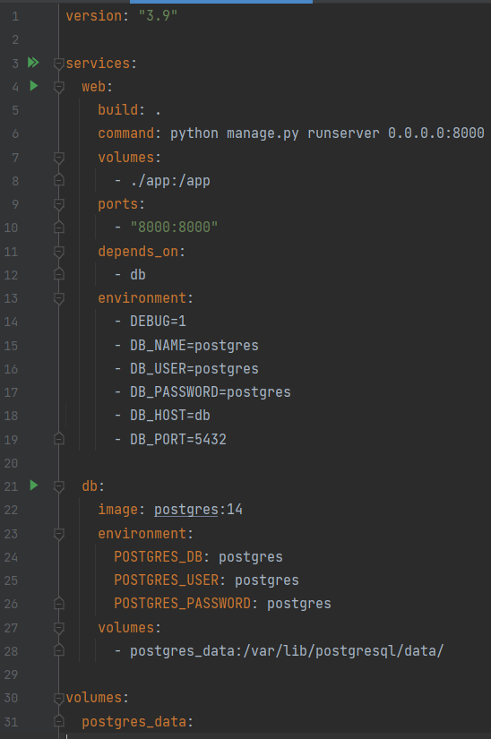

# گزارش آزمایش ششم 

##  بخش اول: استقرار پروژه

در این بخش پروژه را با استفاده از داکر مستقر می‌کنیم:

### مرحله‌ی اول: آماده کردن پروژه
در این مرحله نیازمندی‌های پروژه که شامل جنگو و postgresql می‌شود را به requirements.txt اضافه کردیم:

سپس تنظیمات برنامه را تغییر دادیم تا پایگاه داده postgresql باشد:

### مرحله‌ی دوم: اضافه کردن DockerFile
در این بخش DockerFile را برای ساخت image پروژه آماده کردیم:

خط 2: از image پایتون برای شروع استفاده می‌کنیم.

خط 4 و 5: متغیرهای environment را برای عملکرد مطلوب سیستم داخل داکر تعیین می‌کنیم. متغیر اول تعیین می‌کند که فایل‌های .pyc ساخته نشوند تا کانتینر تمیزتر باقی بماند. و متغیر دوم نیز تعیین می‌کند که لاگ‌های پایتون بدون بافر شدن و بلافاصله چاپ شوند.

خط 7:مشخص می‌کنیم که work directory ما داخل کانتینر چیست.

خط 9: فایل requirements.txt را داخل کانتینر کپی می‌کند.

خط 10: requirementها را نصب می‌کند.

خط 12: کل فایل‌های اپلیکیشن را داخل کانتینر کپی می‌کند.

### مرحله‌ی سوم: اضافه کردن docker-compose
در این مرحله docker compose را برای ساخت تمام کانتینرهای موردنیاز برنامه ایجاد می‌کنیم:

در این فایل دو سرویس تعریف شده اند:

#### web
این سرویس در واقع برنامه‌ی جنگوی ما را مشخص می‌کند.

خط 5: تعیین می‌کند که image مربوط به این کانتینر در DockerFileای که ساختیم آمده است.

خط 6: دستور شروع برنامه را مشخص می‌کند.

خط 7: فایل‌های کد سیستم لوکال و داکر را به هم متصل می‌کند. طوری که با به‌روزرسانی کد برنامه کد داخل کانتینر نیز به‌روز شود.

خط 9: پورت ۸۰۰۰ کانتینر را به پورت ۸۰۰۰ سیستم لوکال متصل می‌کند.

خط 11: تعیین می‌کند که این کانتینر به کانتینر بعدی وابسته است.

خط 13: environment variableهایی که برنامه به آن‌ها نیاز دارد را تعیین می‌کند. برای مثال مشخصات پایگاه داده در آن تعیین شده‌اند.

#### db
این سرویس دیتابیس postgresql است.

خط 22: image مربوط به این کانتینر مشخص شده است.

خط 23: environment variableهایی مانند نام و رمز پایگاه داده‌ای که ساخته می‌شود مشخص شده‌اند.

خط 27 تا 31: یک پوشه در سیستم لوکال را به یک پوشه در کانتینر متصل می‌کند. این موضوع باعث می‌شود که هر بار با پایین رفتن داکر تمام داده‌ها از دست نروند.

