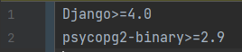
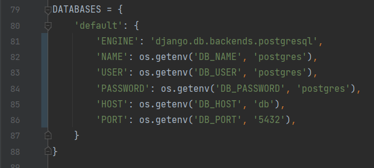
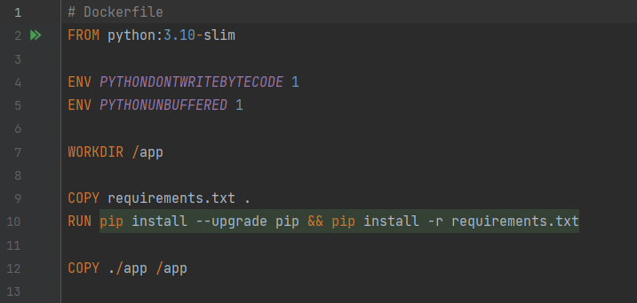

# گزارش آزمایش ششم 

##  بخش اول: استقرار پروژه

در این بخش پروژه را با استفاده از داکر مستقر می‌کنیم:

### مرحله‌ی اول: آماده کردن پروژه
در این مرحله نیازمندی‌های پروژه که شامل جنگو و postgresql می‌شود را به requirements.txt اضافه کردیم:

سپس تنظیمات برنامه را تغییر دادیم تا پایگاه داده postgresql باشد:

### مرحله‌ی دوم: اضافه کردن DockerFile
در این بخش DockerFile را برای ساخت image پروژه آماده کردیم:

خط 2: از image پایتون برای شروع استفاده می‌کنیم.

خط 4 و 5: متغیرهای environment را برای عملکرد مطلوب سیستم داخل داکر تعیین می‌کنیم. متغیر اول تعیین می‌کند که فایل‌های .pyc ساخته نشوند تا کانتینر تمیزتر باقی بماند. و متغیر دوم نیز تعیین می‌کند که لاگ‌های پایتون بدون بافر شدن و بلافاصله چاپ شوند.

خط 7:مشخص می‌کنیم که work directory ما داخل کانتینر چیست.

خط 9: فایل requirements.txt را داخل کانتینر کپی می‌کند.

خط 10: requirementها را نصب می‌کند.

خط 12: کل فایل‌های اپلیکیشن را داخل کانتینر کپی می‌کند.
