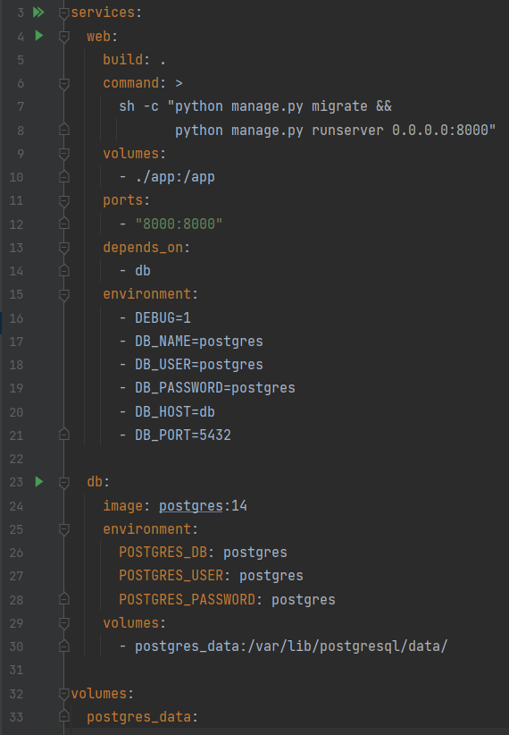

# گزارش آزمایش ششم 

##  بخش اول: استقرار پروژه

در این بخش پروژه را با استفاده از داکر مستقر می‌کنیم:

### مرحله‌ی اول: آماده کردن پروژه
در این مرحله نیازمندی‌های پروژه که شامل جنگو و postgresql می‌شود را به requirements.txt اضافه کردیم:


سپس تنظیمات برنامه را تغییر دادیم تا پایگاه داده postgresql باشد:


### مرحله‌ی دوم: اضافه کردن DockerFile
در این بخش DockerFile را برای ساخت image پروژه آماده کردیم:


خط 2: از image پایتون برای شروع استفاده می‌کنیم.

خط 4 و 5: متغیرهای environment را برای عملکرد مطلوب سیستم داخل داکر تعیین می‌کنیم. متغیر اول تعیین می‌کند که فایل‌های .pyc ساخته نشوند تا کانتینر تمیزتر باقی بماند. و متغیر دوم نیز تعیین می‌کند که لاگ‌های پایتون بدون بافر شدن و بلافاصله چاپ شوند.

خط 7:مشخص می‌کنیم که work directory ما داخل کانتینر چیست.

خط 9: فایل requirements.txt را داخل کانتینر کپی می‌کند.

خط 10: requirementها را نصب می‌کند.

خط 12: کل فایل‌های اپلیکیشن را داخل کانتینر کپی می‌کند.

### مرحله‌ی سوم: اضافه کردن docker-compose
در این مرحله docker compose را برای ساخت تمام کانتینرهای موردنیاز برنامه ایجاد می‌کنیم:



در این فایل دو سرویس تعریف شده اند:

#### web سرویس
این سرویس در واقع برنامه‌ی جنگوی ما را مشخص می‌کند.

خط 5: تعیین می‌کند که image مربوط به این کانتینر در DockerFileای که ساختیم آمده است.

خط 6: دستورات جنگو برای شروع برنامه را مشخص می‌کند.

خط 9: فایل‌های کد سیستم لوکال و داکر را به هم متصل می‌کند. طوری که با به‌روزرسانی کد برنامه کد داخل کانتینر نیز به‌روز شود.

خط 11: پورت ۸۰۰۰ کانتینر را به پورت ۸۰۰۰ سیستم لوکال متصل می‌کند.

خط 13: تعیین می‌کند که این کانتینر به کانتینر بعدی وابسته است.

خط 15: environment variableهایی که برنامه به آن‌ها نیاز دارد را تعیین می‌کند. برای مثال مشخصات پایگاه داده در آن تعیین شده‌اند.

#### db سرویس
این سرویس دیتابیس postgresql است.

خط 24: image مربوط به این کانتینر مشخص شده است.

خط 25: environment variableهایی مانند نام و رمز پایگاه داده‌ای که ساخته می‌شود مشخص شده‌اند.

خط 29 تا 33: یک پوشه در سیستم لوکال را به یک پوشه در کانتینر متصل می‌کند. این موضوع باعث می‌شود که هر بار با پایین رفتن داکر تمام داده‌ها از دست نروند.

#### مرحله‌ی آخر: ساختن کانتینرها
با اجرای دستور زیر کانتینرها ساخته می‌شوند و سرویس وب از پورت ۸۰۰۰ لوکال در دسترس خواهد بود:

```shell
docker-compose up --build
```

تصویر زیر بخشی از فرایند اجرای دستور بالا را نمایش می‌دهد:


## بخش دوم: ارسال درخواست به وب‌سرور

### ساخت کاربر
در این بخش لازم است که به ساخت کاربری با نام user1 و پسورد 1234 بپردازیم. برای این منظور دستور curl زیر را اجرا می‌کنیم و خروجی زیر را می‌گیریم:

```
curl -X POST http://localhost:8000/users/create/ \
     -d "username=user1&password=1234"
```


### لاگین و ساخت نوشته‌ها
در این بخش لازم است که توسط کاربری که در بخش پیشین ساخته بودیم، دو عدد نوشته با تایتل و بدنه‌ی مدنظر بسازیم. به این منظور، ابتدا لازم است که با کمک دستور زیر به عنوان user1 لاگین شویم:

```
curl -c POST http://localhost:8000/users/login/ \
     -d "username=user1&password=1234"
```
و در ادامه و پس از دریافت ورود موفقیت‌آمیز، دو نوشته با تایتل‌های title1 و title2 و بدنه‌ی body1 و body2 می‌سازیم:

```
curl -X POST http://localhost:8000/notes/create/ \
     -d "title=title1&body=body1"
curl -X POST http://localhost:8000/notes/create/ \
     -d "title=title2&body=body2"
```

خروجی دستورات، در تصویر زیر قابل مشاهده است.


### خروجی تمام نوشته‌ها
در انتها لازم است از تمامی نوشته‌‌های تولید شده توسط user1 (یوزر لاگین شده) خروجی بگیریم. در این راستا، دستور زیر را اجرا می‌کنیم:


```
curl http://localhost:8000/notes/
```
که خروجی، مطابق تصویر زیر می‌باشد.


## بخش سوم: تعامل با داکر 
### تسک اول 
ابتدا با دستور زیر تمامی ایمیج های خود را مشاهده میکنیم که از بین آنها se_lab_project6-web مربوط به پروژه ماست که بعد از ساختن کانتینرها ایجاد شده است.
همچنین postgres ایمیج رسمی ای است که پایگاه داده مان از داکرهاب دریافت میکند.
```shell
docker images
```

با دستور زیر لیستی از کانتینرهایمان میبینیم. که اولی برای سرویس وب و دومی برای سرویس پایگاه داده مان است.
```shell
docker ps
```

### تسک دوم 
ابتدا با دستور اول وارد کانتینر وب سرور مان میشویم.
کامند دوم یک سیستم چک برای پیگربندی پروژه مان انجام میدهد و همان طور که میبینیم مشکلی پیدا نکرده است.
کامند دوم تمامی فایل ها و دایرکتوری های درون فولدر /app در کانتینر را نشان میدهد (به همراه سطح دسترسی آنها، آخرین تاریخ ادیت و متادیتاهای دیگر)
```shell
docker exec -it se_lab_project6-web-1 bash
python manage.py check
ls -la /app
```


## پرسش ها 
### پرسش اول 
وقتی میخواهیم یک اپلیکیشن را با داکر بسته بندی کنیم، ابتدا یک dockerfile مینویسیم:
این فایل مشخص میکند که نقظه شروعمام چه ایمیجی باشد، چه بسته ها و تنظیماتی باید اضافه شود (نصب کتابخانه ها، تنظبم متغیرهای محیطی، کپی کردن کد به مسیر /app و تعریف دستور پیش فرض برای اجرا)
خروجی ساخت یا build این فایل، همان تصویر یا image است؛ یک بسته فضرده و لایه ای که تمام وابستگی ها و کد ما را در یک اسنپ شات قرار میدهد.
هربار که میخواهیم اپ را اجرا کنیم، داکر از این تصویر یک container میسازد: کانتینر یک ماشین مجازی سبک است که پروسه های ما را درون یک محیط ایزوله (با شبکه و فایل سیستم و منابع جداگانه) اجرا میکند، اما بسیار کم هزینه تر از ماشین مجازی یا VM است چون از هسته میزبان مشترک استفاده میکند.

### پرسش دوم 
درمقیاس بزرگ که کانتینرها و سرورها زیاد میشود، مدیریت دستی آنها دشوار و خطاپذیر است. اینجا کوبرنیتز وارد میشود
کوبرنیتز یک لابه بالاتر فراهم میکند تا بتوانیم تعداد زیادی کانتینر را به صورت خودکار مستقر (deploy)، مقیاس دهی (scale) و به روزرسانی پیوسته کنیم و در برابر خرابی ها بازیابی کنیم.
رابطه داکر و کوبرنیتز این است که کوبرنیتز برای اجرای کانتینرها به یک runtime نیاز دارد و معمولا همان docker engine یا یکی از پیاده سازی های سازگار با استاندارد OCI را استفاده میکند. به عبارتی داکر و کانتینر مکمل یکدیگر میشوند: داکر، کانتینر ها را میسازد و اجرا میکند و کوبرنیتز آن ها را در خوشه های سرور هماهنگ و مقیاس میدهد.
